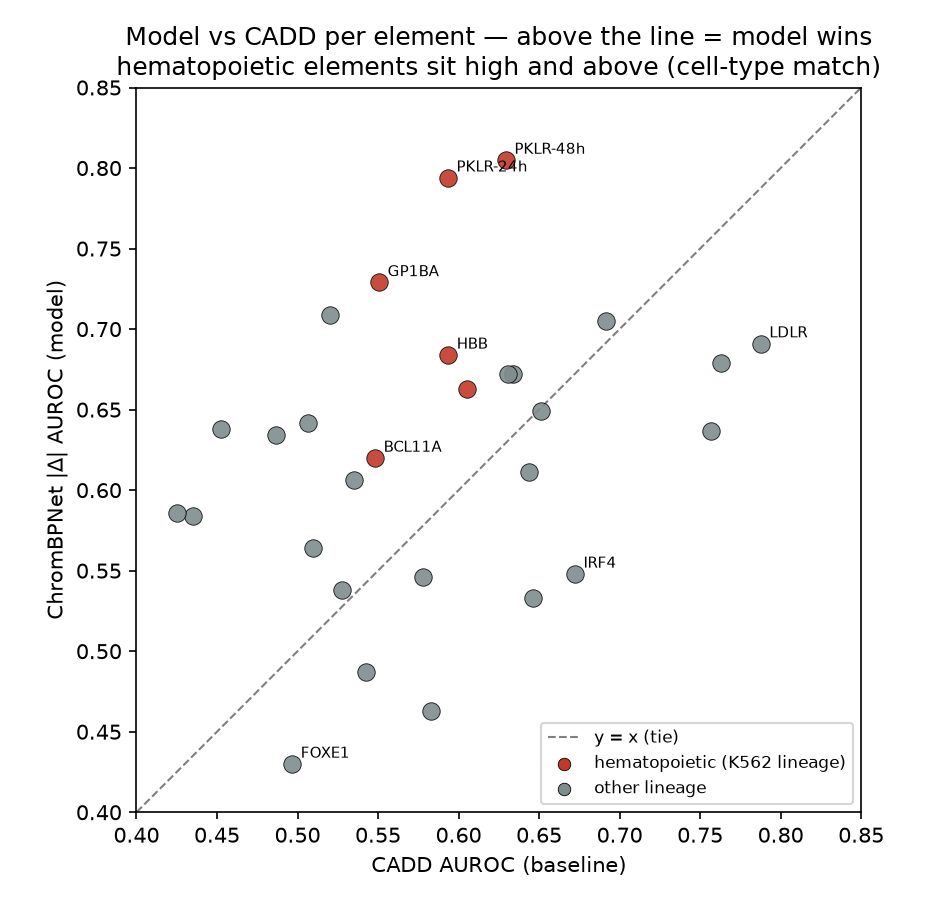
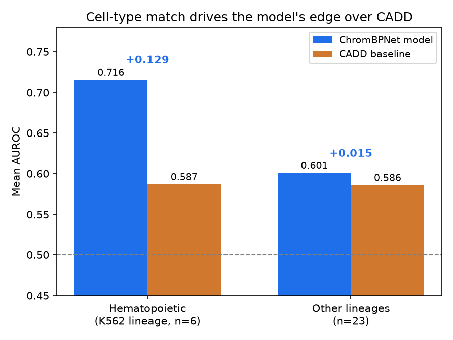

# RegLens

**An agentic mechanistic interpreter for noncoding regulatory variants.**

Annotation tools (VEP/ANNOVAR) tell you *where* a noncoding variant is — "intergenic,
modifier." Sequence models (ChromBPNet/Enformer) score *that* it has an effect but don't
explain it. **RegLens is the bridge:** give it a noncoding variant + a cell-type context,
and a deep-learning chromatin model plus a multi-agent reasoning layer produce a
**cited, cell-type-specific, mechanistic interpretation** — which TF motif is disrupted, in
which regulatory element, plausibly affecting which gene, linked to which trait, and why —
with a calibrated confidence and explicit caveats.

> We *explain what the sequence models see* — we do **not** claim to out-predict them.
> Every number is computed by a deterministic tool; the agents reason over those numbers but
> never invent a score. Every interpretation is a hypothesis with confidence + caveats.

The distinctive thing here isn't the pieces — it's that the reasoning layer is **validated
as ruthlessly as the model**: we measured whether the agent confabulates, whether it
recovers known mechanisms, what the multi-agent architecture actually buys, and whether its
confidence tracks the evidence. It does. And when asked to propose something *new*, it
refuses to manufacture a claim.

---

## Results at a glance

| Layer | What we measured (honestly) | Result |
|---|---|---|
| **Engine** | AUROC on matched MPRA (33k SNVs) vs CADD | **0.622** vs 0.556; **0.716 on-lineage** |
| **Engine** | Cell-type *causation* (K562 ↔ HepG2 crossover) | **double dissociation** (bootstrap CI) |
| **Agent** | Confabulation — null control, 24 deliberations | **0 confabulations** (≤12%, rule of three) |
| **Agent** | Known-mechanism recovery (n = 11) | trait **11/11**, gene 10/11, TF 8/11 |
| **Agent** | Architecture ablation (single vs multi vs +red-team) | layers only ever **lower** overconfidence |
| **Agent** | Confidence calibration (strong / weak / null) | `medium+` only in strong (**0 / 0 / 45 %**) |
| **Discovery** | Unbiased GWAS screen (100 variants) | 0 forced hits; guardrail caught a *solved* lead |

Full numbers, transcripts, and caveats: **[`RESULTS.md`](RESULTS.md)**. Every experiment is
reproducible on a GPU via **[`notebooks/`](notebooks/)**; the logic is covered by **204
offline tests**.

## The demo in one screen

**Recover** — `rs1427407` (chr2:60,490,908 T>G), which VEP calls "intergenic":
> Alt G creates a **GATA1::TAL1** composite motif (3.21→8.66 bits) — i.e. the ref **T
> allele disrupts** the erythroid element; ChromBPNet predicts a concordant K562
> accessibility gain; the variant is **inside BCL11A**'s +58 enhancer; GWAS-linked to
> **fetal hemoglobin** (p=4e-53). *Confidence: medium* — the red-team flagged the small
> ChromBPNet effect, the eQTL pointing to C2orf74 (not BCL11A), and LD confounding.
> Cited: PMID 24115442, 26375006. ✅ matches the textbook mechanism (Bauer/Canver).

**Discover** — `rs2814778` (chr1:159,204,893 T>C), fed in cold:
> Alt C **abolishes a GATA1::TAL1 motif** (16.78→2.18 bits) at the **ACKR1/Duffy** erythroid
> promoter; linked to **neutrophil count**. ✅ RegLens recovered the Duffy-null mechanism
> from scratch — nothing hardcoded.

## How it works — two layers

```
 variant (chr:pos ref>alt, hg38) + cell-type
        │
   DETERMINISTIC TOOL LAYER  (no LLM — computes every number)
     chrombpnet_score · motif_effect · regulatory_context · gene_target · trait_link · literature
        │  evidence bundle (JSON)
        ▼
   MULTI-AGENT REASONING LAYER  (Anthropic Messages API, structured output)
     4 specialists  →  red-team  →  adjudicator
        ▼
   cited mechanistic interpretation (confidence + caveats)
```

- **Deterministic layer** — six tools compute Δ accessibility (ChromBPNet, fold + RC
  averaged), the disrupted/created TF motif (JASPAR PWM in-silico mutagenesis), ENCODE cCRE
  overlap, nearest gene + GTEx eQTL, GWAS trait links, and real Europe PMC citations. No LLM;
  nothing invented. Also exposed as an **[MCP server](#mcp-server)**.
- **Reasoning layer** — four specialists each assess one facet, an optional **red-team**
  challenges the story (model artifact? LD hitchhiker? cell-type mismatch?), and an
  **adjudicator** synthesizes the final cited hypothesis. A citation guard drops any PMID not
  in the bundle.

## Validation — the engine

We validate the **engine** (the variant score, `|Δ log-counts|`) on the **Kircher
saturation-mutagenesis MPRA** (33,359 SNVs, 29 disease-element assays) with **matched
within-element negatives** — the honest, hard comparison — against a **CADD** baseline.

| | Model | CADD | Δ |
|---|---|---|---|
| **Overall** (matched) | **0.622** | 0.556 | +0.066 |
| **Hematopoietic elements** (K562 lineage) | **0.716** | 0.587 | **+0.129** |
| Other lineages | 0.601 | 0.586 | +0.015 (tied) |

<p align="center">
  
  
</p>

The edge is **lineage-specific** — largest where the cell type matches, tied elsewhere. To
prove that's *causal* and not an artifact, we ran the **same** benchmark with a **HepG2
(hepatic)** model: the winning elements swap with the model (hematopoietic K562 0.716→0.569;
hepatic K562 0.633→HepG2 0.663) — a **double dissociation**. Cluster-bootstrap CIs report it
honestly: robust on the blood side (**+0.147, 95% CI [+0.072, +0.226]**), directional but
not significant on the hepatic side (**+0.030, [−0.015, +0.069]**).

<p align="center"></p>

## Validation — the agent

Most tool papers "validate" the reasoning layer with a couple of hand-picked examples. We
measured it — four experiments, all in [`RESULTS.md`](RESULTS.md), reproducible in
[`notebooks/03`](notebooks/03_agent_null_control.ipynb) and
[`04`](notebooks/04_agent_reasoning.ipynb).

- **It doesn't confabulate — the biconditional.** Run on MPRA *negatives* (non-functional
  variants sitting in active elements), the agent **declines** rather than inventing a
  mechanism; forced onto strong-signal positives, it **asserts** a concordant one. Across
  three arms and **24 deliberations: 0 confabulations** — a 95% upper bound of **≈12%** on
  the true rate (rule of three). It names a mechanism *iff* the engine fires.
- **It recovers known mechanisms.** On 11 characterized regulatory variants (rsID→hg38 via
  Ensembl, no hand-typed coordinates): **trait 11/11, gene 10/11, TF 8/11**. The TF misses
  are *honest* — it refused to name a TF the motif tool didn't surface even when it clearly
  knew the textbook answer (e.g. LCT/Oct-1), rather than confabulate from memory.
- **The architecture earns its keep.** Single-agent vs multi-agent−redteam vs full, over the
  *same* bundle: the layers **only ever lower** overconfidence, never raise it — the
  red-team tempers a real-but-weak-signal call, the multi-agent structure catches a null the
  single agent over-read, and both preserve confidence where the evidence is fully concordant.
- **It knows what it doesn't know.** Confidence (high/med/low) across strata: `medium+`
  appears in **0%** of null and **0%** of weak-effect cases, **45%** of strong known
  mechanisms — and the lone `high` is reserved for the one variant where every channel,
  *including a cell-type-matched model*, concurs.

## What it's for — prospective, falsifiable hypotheses

Recovery proves trust; the point of the tool is the forward direction — screening noncoding
variants for **interpretable, uncharacterized** regulatory mechanisms
([`notebooks/05`](notebooks/05_discovery_screen.ipynb)). We screen blood-trait GWAS variants
**in-domain** (K562, where the engine is validated) and rank by a discovery quadrant (large
`|Δ|` + concordant motif + real GWAS trait + sparse literature).

Run over **100 unbiased GWAS-Catalog variants, it flagged none** — raw lead SNPs are mostly
LD tags that don't fire the engine, so the tool **refuses to rubber-stamp associations**. Its
one near-lead (`rs342293`) *looked* novel to our pipeline, but the **mandatory manual novelty
check found it already characterized** (EVI1/MECOM → PIK3CG in megakaryocytes) — so we don't
claim it. The guardrail working is the result; see
[`docs/discovery_worked_example_rs342293.md`](docs/discovery_worked_example_rs342293.md).

## Limitations

Called out where they apply, and collected in [`RESULTS.md`](RESULTS.md#limitations): one
cell type per model; a motif-library ceiling (some real effects have no nameable JASPAR
motif); LD/causality unresolved (hypotheses, not proof); an MPRA-vs-endogenous modality gap;
the hepatic crossover arm underpowered; and small n's throughout (bounds reported, e.g. the
rule-of-three above).

## Install

```bash
python -m venv .venv && source .venv/bin/activate
pip install -e ".[dev]"            # core + tests (offline stub backend, no TensorFlow)
# pip install -e ".[chrombpnet]"   # + TensorFlow for real pretrained inference
# pip install -e ".[agents]"       # + anthropic SDK for the reasoning layer (needs an API key)
# pip install -e ".[mcp]"          # + MCP SDK to run the tool layer as an MCP server
```

The reasoning layer defaults to `claude-opus-4-8` with adaptive thinking; override the
model with `REGLENS_MODEL_ID` (e.g. `export REGLENS_MODEL_ID=claude-sonnet-5`).

## Quickstart

```bash
reglens demo                        # offline synthetic demo — no downloads, no API key

# Full analysis (deterministic evidence + optional interpretation):
reglens analyze 'chr2:60490908:T>G' --rsid rs1427407 --celltype K562 \
        --interpret --multi-agent   # add --genome hg38.fa --model <dir> for ChromBPNet+motif

# Validate the engine (AUROC vs CADD) on a labeled benchmark:
reglens validate data/benchmarks/kircher_mpra_grch38.cadd.tsv --genome hg38.fa --model <fold_dir>
```

Task-based Colab notebooks in [`notebooks/`](notebooks/) reproduce every experiment on a GPU
— engine AUROC (01), the crossover (02), the agent controls (03), agent reasoning (04), and
the discovery screen (05); see [`notebooks/README.md`](notebooks/README.md). `reglens/model/`
holds the pretrained-model verification and the training/extensibility demo.

## MCP server

The deterministic tool layer is also an **MCP stdio server**, so any MCP host (Claude
Desktop, etc.) can call it. Seven tools — `get_evidence_bundle` (the primary interface: all
signals for a variant in one call), plus `score_variant`, `motif_effect`,
`regulatory_context`, `gene_target`, `trait_link`, `literature` — thin wrappers over
`reglens.tools.*` that compute no new numbers.

```bash
pip install -e ".[mcp]" && reglens-mcp     # or: python -m reglens.mcp_server
```

The annotation tools always work; the sequence-model tools read `REGLENS_GENOME` (an hg38
FASTA — required for `score_variant`/`motif_effect`, with a clear error if unset) and
`REGLENS_MODEL` (a ChromBPNet model/fold dir; a labelled offline stub if unset). Register it
in `claude_desktop_config.json`:

```json
{
  "mcpServers": {
    "reglens": {
      "command": "reglens-mcp",
      "env": { "REGLENS_GENOME": "/path/to/hg38.fa", "REGLENS_MODEL": "/path/to/fold_dir" }
    }
  }
}
```

## Repo layout

```
reglens/
  tools/        chrombpnet_score · motif_effect · regulatory_context · gene_target · trait_link · literature
  agents/       interpreter (single) · multi_agent (specialists → red-team → adjudicator) · _llm
  validation/   harness · metrics · dataset · cadd · lineage · null_control · agent_eval · discovery
  report/       schema · render · plot          model/  ChromBPNet wrappers + notebooks
  orchestrator.py · cli.py · genome.py · mcp_server.py
notebooks/      01_engine_validation · 02_crossover · 03_agent_null_control · 04_agent_reasoning · 05_discovery_screen
data/benchmarks/  Kircher MPRA benchmark (+ CADD)   figures/  money-shots   docs/  discovery notes
tests/  (204, all offline)   RESULTS.md   RegLens_spec.md
```

## Test

```bash
pytest                       # 204 tests, fully offline (no network, no GPU, no API key)
ruff check reglens tests
```

## License

[Apache-2.0](LICENSE). Built entirely from open data/tools: ChromBPNet, ENCODE, UCSC, JASPAR
(CC0), GTEx, GWAS Catalog, Europe PMC, Kircher satMutMPRA, CADD.
