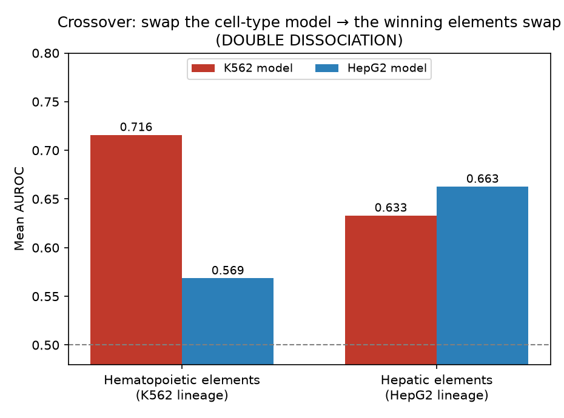
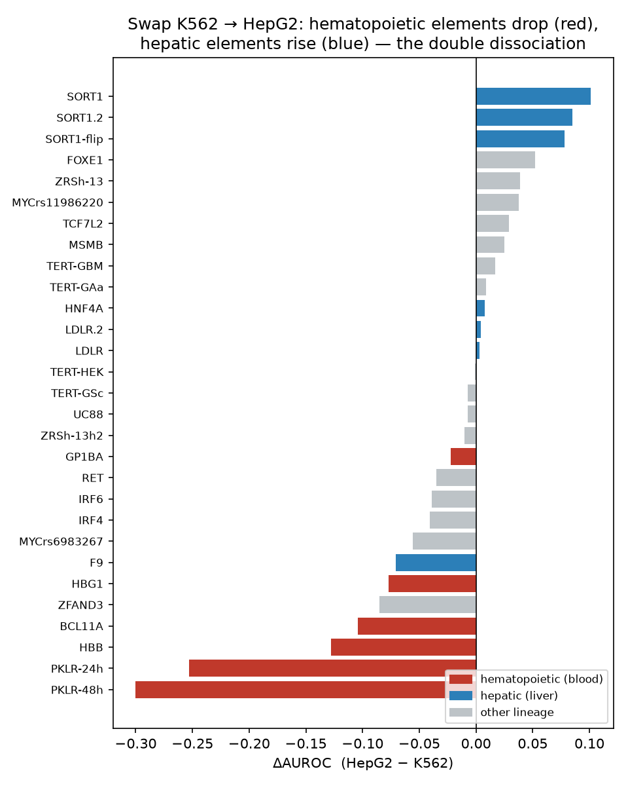

# RegLens — validation results

Validates the **engine** (the ChromBPNet variant score, `|Δ log-counts|`) at ranking
functional regulatory variants above non-functional ones. This is a *separate* claim
from the **agent** (multi-agent mechanistic interpretation), which is validated by
recovering known mechanisms (rs1427407 BCL11A/GATA1, rs2814778 ACKR1/Duffy) and by the
red-team catching artifacts.

## Benchmark

**Kircher et al. 2019 saturation-mutagenesis MPRA** (GSE126550) — the matched, hard
comparison. Positives = variants with a significant regulatory effect (`pValue < 0.01`);
negatives = variants **in the same regulatory elements** with no effect (`pValue ≥ 0.10`).
Negatives are **matched by design**, not random genomic controls — the honest test.

- **33,359 SNVs · 29 element assays · 11,973 positive / 21,386 negative**, GRCh38.
- Model: **ENCODE K562 ATAC ChromBPNet** (ENCFF984RAF), 5-fold + reverse-complement
  averaged. Scored in ~26 min (batched); 0 scoring errors.

## Headline — the model beats CADD, most on its own cell type

| | Model (`\|Δ log-counts\|`) | CADD (baseline) | Δ |
|---|---|---|---|
| **Overall (matched, within-element)** | **0.622** | 0.556 | **+0.066** |
| **Hematopoietic elements** | **0.716** | 0.587 | **+0.129** |
| Other elements | 0.601 | 0.586 | +0.015 |

CADD PHRED v1.7 baseline, computed on the **same** 33,359 variants (pulled from CADD's
pre-scored whole-genome file). The model **beats CADD overall (+0.066)** and wins in
**18 / 29 elements** — but the story is in *where* it wins.

## Cell-type specificity (the real story)

The K562 model is **erythroid/hematopoietic**, and both the absolute AUROC *and* the
margin over CADD track that:

- **On hematopoietic elements** (BCL11A, HBB, HBG1, PKLR-24h/48h, GP1BA): model **0.716**
  vs CADD **0.587** — a **+0.13** margin. The cell-type-appropriate deep model adds large
  signal beyond generic conservation.
- **On non-hematopoietic elements**: model 0.601 vs CADD 0.586 — **≈ tied** (+0.015). With
  the wrong cell type, the model has no edge over CADD.

**A cell-type-matched chromatin model beats a cell-type-agnostic conservation score — but
only in the matching cell type.** That is RegLens's whole thesis, measured. The biggest
per-element wins are all hematopoietic (PKLR-48h +0.175, PKLR-24h +0.200, GP1BA +0.178);
CADD wins on non-erythroid elements (LDLR −0.10 hepatic, IRF4/IRF6 −0.12, ZFAND3 −0.12).

**Honest caveats:** overall +0.066 is a modest margin; the strength is the *stratified*
result. It's a tendency, not perfect (a few broad elements like TERT are close; CADD wins
11/29). All numbers are on the matched benchmark; none are cherry-picked negatives.

## The crossover — a double dissociation (strongest result)

We ran the **same** 33,359-variant benchmark with a **HepG2 (hepatic)** ChromBPNet model
(ENCODE ENCFF137WCM) and compared it to the K562 (erythroid) model. The result is a
**double dissociation** — swap the cell-type model, and which elements it wins on swaps
with it:

| Compartment | K562 model | HepG2 model | winner |
|---|---|---|---|
| **Hematopoietic** elements | **0.716** | 0.569 | K562 (+0.147) |
| **Hepatic** elements | 0.633 | **0.663** | HepG2 (+0.030) |

<p align="center">
  
  
</p>

**The per-element tell is unmistakable:** the biggest *risers* when swapping K562→HepG2
are the hepatic **SORT1** assays (+0.08 to +0.10); the biggest *fallers* are the blood
elements — **PKLR-48h collapses 0.805 → 0.505** (near chance), PKLR-24h −0.25, HBB/BCL11A
−0.10 to −0.13. The intervention (change the cell-type model) moves exactly the elements
cell-type theory predicts.

This turns the thesis from *measured* to *demonstrated by intervention*: the AUROC signal
is genuinely **cell-type-driven, not a model artifact** — a model artifact would not flip
its winning elements when you swap the cell type.

**Honest caveats — quantified.** A cluster bootstrap (10,000 resamples over the *elements*
in each compartment — the correct unit, since variants within an element are correlated)
puts a CI on each side's advantage:

| Compartment | own-model Δ AUROC | 95% CI | robust? |
|---|---|---|---|
| **Hematopoietic** (K562 wins) | **+0.147** | **[+0.072, +0.226]** | ✅ CI clears zero (p wrong-sign = 0.00) |
| **Hepatic** (HepG2 wins) | +0.030 | [−0.015, +0.069] | ⚠️ crosses zero (p wrong-sign = 0.09) |

So the dissociation is **asymmetric and honestly reported**: the blood side is robust; the
hepatic side is **directional** — 91% of resamples favor HepG2 — but *not* distinguishable
from zero at the element level (n=7, and one element, **F9** liver-coagulation, drops under
HepG2 against the trend). The double dissociation is carried by the strong hematopoietic
arm plus the decisive per-element extremes (SORT1 up, PKLR-48h 0.805→0.505 down); the
hepatic-arm mean is suggestive, not significant. (The CI reflects between-element variance
only — per-variant sampling noise would need the raw scores. Reproduce:
`reglens.validation.lineage.bootstrap_crossover_ci`.)

## Full per-element AUROC

| Element | AUROC | pos / neg | | Element | AUROC | pos / neg |
|---|---|---|---|---|---|---|
| PKLR-48h | 0.805 | 464 / 717 | | LDLR.2 | 0.679 | 499 / 324 |
| PKLR-24h | 0.794 | 409 / 796 | | HBG1 | 0.663 | 285 / 403 |
| GP1BA | 0.729 | 313 / 668 | | TERT-GAa | 0.649 | 302 / 346 |
| UC88 | 0.709 | 184 / 1310 | | F9 | 0.642 | 280 / 490 |
| TERT-HEK | 0.705 | 238 / 399 | | SORT1-flip | 0.638 | 938 / 635 |
| LDLR | 0.691 | 406 / 405 | | ZFAND3 | 0.637 | 542 / 961 |
| HBB | 0.684 | 186 / 276 | | MYCrs6983267 | 0.634 | 219 / 1282 |
| TERT-GSc | 0.672 | 335 / 333 | | BCL11A | 0.620 | 199 / 1324 |
| TERT-GBM | 0.672 | 390 / 275 | | HNF4A | 0.611 | 263 / 451 |
| MSMB | 0.606 | 640 / 853 | | SORT1 | 0.586 | 1014 / 554 |
| SORT1.2 | 0.584 | 916 / 665 | | ZRSh-13h2 | 0.564 | 334 / 864 |
| IRF4 | 0.548 | 847 / 356 | | RET | 0.546 | 405 / 1081 |
| ZRSh-13 | 0.538 | 336 / 881 | | IRF6 | 0.533 | 620 / 862 |
| TCF7L2 | 0.487 | 281 / 1212 | | MYCrs11986220 | 0.463 | 63 / 1152 |
| FOXE1 | 0.430 | 65 / 1511 | | | | |

## Agent null control — does it confabulate on non-functional variants?

The question almost nobody tests: handed an MPRA **negative** (non-functional, yet sitting
in or beside an *active* regulatory element of a famous gene, in the matching cell type),
does the multi-agent invent a plausible-sounding mechanism, or correctly decline?

`reglens/validation/null_control.py` draws negatives (`label == 0`) from the same matched
benchmark, runs the full specialists → red-team → adjudicator deliberation on each, and
classifies the adjudicated interpretation by a transparent rubric: **declined** (no
mechanism asserted, or an explicit "no coherent mechanism"), **borderline** (a mechanism
named but at *low* confidence), **confabulated** (a specific TF-disruption mechanism
asserted at *medium/high* confidence).

**Preliminary pilot — 6 hematopoietic negatives, run locally (annotation-only).** The
sequence signals were deliberately withheld (no ChromBPNet Δ, no motif) — the *hardest*
confabulation temptation, since the agent has only "this variant overlaps the BCL11A / HBB
/ PKLR body or a K562 enhancer" to go on:

| verdict | count | confidence |
|---|---|---|
| **declined** | **6 / 6** | all low |
| borderline | 0 / 6 | — |
| confabulated | 0 / 6 | — |

Every call refused to name a TF or assign a mechanism, and grounded the refusal in the
*missing numbers* — e.g. *"no ChromBPNet Δ log-counts … so no TF-motif disruption can be
identified … any mechanistic claim rests entirely on genic overlap and external priors,
not on data in the bundle."* For a negative near the β-globin locus it named and then
*rejected* the tempting story: *"K562 is an erythroid model, [but] no bundle field
annotates HBB … so that framing is unsupported speculation."* The red-team flagged the
absent sequence data as high-severity in every case.

**Read honestly.** This shows the agent's mechanism claims are **gated on the
deterministic layer** — strip the numbers and it declines rather than backfilling from
gene / cell-type priors. It is a strong *preliminary* result, not the complete control:
the faithful test — where the negatives' near-zero ChromBPNet Δ and weak-but-present
motifs *are* in the bundle and the agent could over-read them — runs on Colab through the
same harness (`run_null_control(..., genome_path=hg38, scorer=k562)`). Reported either way.

## Reproduce

```bash
# agent null control (faithful run needs hg38 + the ChromBPNet model + ANTHROPIC_API_KEY):
#   from reglens.validation.null_control import run_null_control, render_summary
#   run_null_control("data/benchmarks/kircher_mpra_grch38.tsv", MultiAgentInterpreter(),
#                    n=8, elements=HEMATOPOIETIC, genome_path=hg38, scorer=k562)
# build the benchmark (matched negatives):
python -m reglens.validation.build_mpra_benchmark -o data/benchmarks/kircher_mpra_grch38.tsv
# CADD baseline — annotate the cadd column from CADD's pre-scored whole-genome file:
python -m reglens.validation.cadd remote data/benchmarks/kircher_mpra_grch38.tsv \
       -o data/benchmarks/kircher_mpra_grch38.cadd.tsv
# run model scoring on a GPU box (hg38 + ENCODE model): reglens/validation/run_validation.ipynb
# crossover figures + bootstrap CIs:
python figures/generate_crossover.py
```

## Status

Engine validation, CADD baseline, cell-type stratification, and the K562-vs-HepG2
crossover (with bootstrap CIs) are all **complete**. What's deliberately *not* claimed:
the hepatic arm of the crossover is directional but not significant at the element level
(see caveat above), and the agent layer is validated separately (mechanism recovery +
red-team), not by AUROC.
